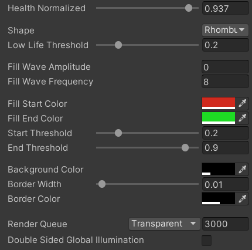

# Procedural healthbar shader

Procedural [healthbar shader](https://github.com/josebasierra/procedural-healthbar-shader/blob/master/Assets/HealthBar/Materials/HealthBar.shader) implemented in HLSL.  
Unity 2021.3 LTS, Universal Render Pipeline (URP).

  
  
